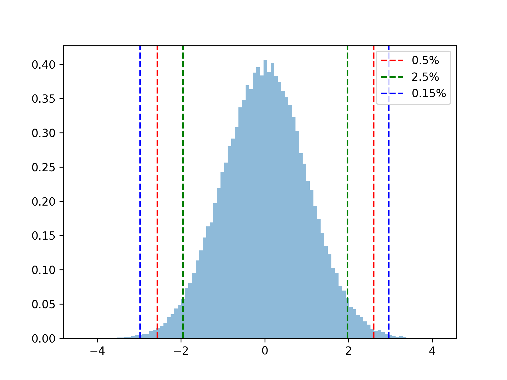

# The Normal Distribution

The normal distribution, also known as the Gaussian distribution, is a probability distribution that is widely used in statistics and science. It is characterized by a bell-shaped curve, which is symmetrical and has a single peak at the center. 

The normal distribution is defined by two parameters: 

1. The mean, which determines the center of the curve, and 
2. The standard deviation, which determines the width of the curve.

The equation for the normal distribution is:

$f(x) = (1/σ√(2π)) e^{(-(x-μ)²/(2σ²))}$

where $f(x)$ is the probability density function of the normal distribution, $x$ is the random variable, μ is the mean, σ is the standard deviation, and e is the mathematical constant, known as Euler's number.

Intuitively, we can think of the normal distribution as a way of describing the variability of a set of data. 


If we have a set of data that is normally distributed, we can use the mean and standard deviation to understand the characteristics of the data. 

-> The mean tells us the central value around which the data is centered, while the standard deviation tells us the spread or variability of the data around the mean.

One of the key features of the normal distribution is the 68-95-99.7 rule, also known as the empirical rule or the three-sigma rule. This rule states that approximately 68% of the data falls within one standard deviation of the mean, 95% of the data falls within two standard deviations of the mean, and 99.7% of the data falls within three standard deviations of the mean. This rule is important because it allows us to make inferences about the likelihood of observing certain values in a normally distributed dataset.

The normal distribution is widely used in statistics and science because it is a useful model for many natural phenomena. For example, many physical and biological measurements, such as height, weight, and IQ scores, are normally distributed in the population. The normal distribution also plays a key role in statistical hypothesis testing and estimation, as many statistical tests assume normality of the underlying data.


```{python}
library(reticulate)
from mpl_toolkits.mplot3d import axes3d
import matplotlib.pyplot as plt
from matplotlib import cm
import numpy as np

def gauss1(x):
    return np.exp(-(x**2))

def gauss(x, y):
    return gauss1(x)*gauss1(2*y)

fig = plt.figure()
ax = fig.add_subplot(projection='3d')
x = np.linspace(-3, 3, 100)
y = np.linspace(-3, 3, 100)
X, Y = np.meshgrid(x, y)
Z = gauss(X, Y)

ax.plot_surface(X, Y, Z, rstride=2, cstride=2, alpha=0.4, cmap=cm.coolwarm)
cset = ax.contourf(X, Y, Z, zdir='x', offset=-4, cmap=cm.coolwarm)
cset = ax.contourf(X, Y, Z, zdir='y', offset=4, cmap=cm.coolwarm)

ax.set_xlabel('X')
ax.set_ylabel('Y')
ax.set_zlabel('Z')

plt.savefig('BiVarNormalDist.png',dpi=300)
plt.show()

```


```{r normal, fig.align="center", out.height="90%", out.width = "90%"}
library(knitr)

```


# Bivariate Normal Distribution 

Bivariate normal distribution is a statistical model that describes the joint distribution of two random variables that are normally distributed. It is used to analyze the relationship between two continuous variables, such as height and weight or income and education level. The distribution is characterized by two parameters: the mean and the covariance. 


The mean represents the center of the distribution, while the covariance measures the degree to which the two variables vary together.

A 3D simulation image of a bivariate normal distribution (see below) shows two variables plotted on the x and y-axis, with the height of the surface representing the probability density of each combination of values. 


The surface is shaped like an elliptical mound, with the peak at the mean of the distribution and the orientation of the ellipse determined by the covariance. 

The shape of the ellipse reflects the degree to which the two variables are correlated, with a more circular shape indicating low correlation and a more elongated shape indicating high correlation. 


The visualization was created as a tool to help statistics students to understand the relationship between two variables in a more intuitive way.


I created this plot to illustrate the Bivariat normal distribution in Python (here is the link to the [code]( https://colab.research.google.com/drive/1gVUhfoiwFYnisKvdE_HEgiYdiuyPZpcp) 


```{r bivar, fig.align="center", out.height="90%", out.width = "90%"}
knitr::include_graphics("BIVARNORMAL.png")
```


