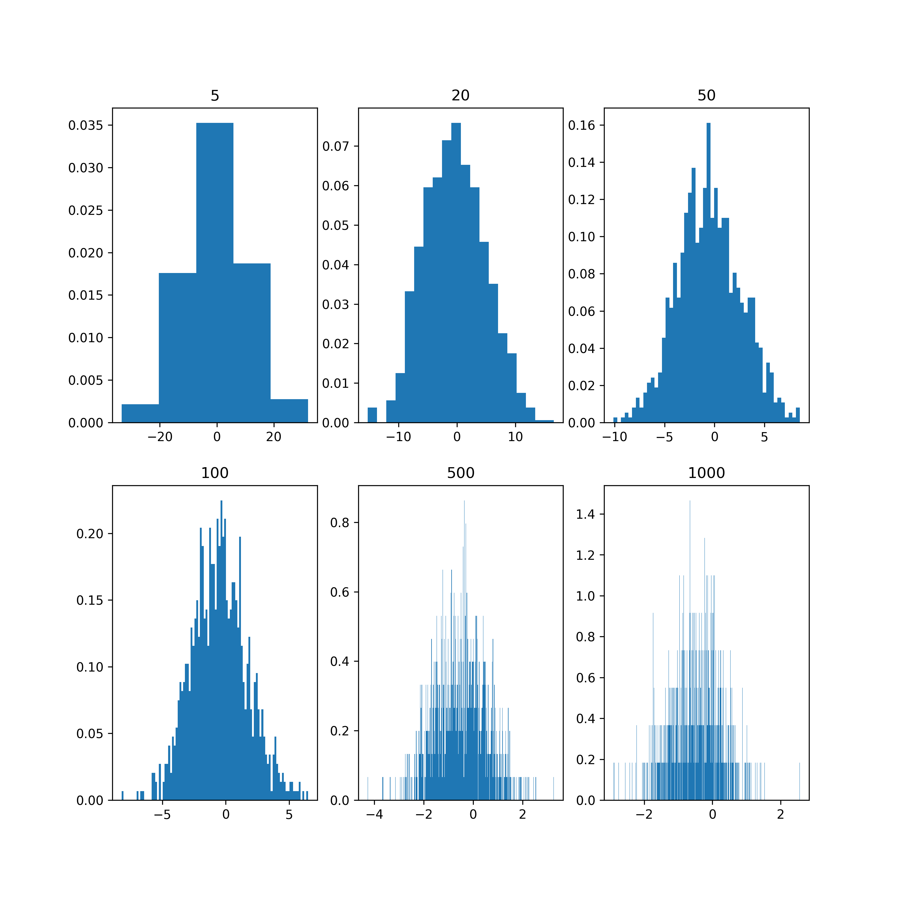

# The Normal Distribution

The normal distribution, also known as the Gaussian distribution, is a probability distribution that is widely used in statistics and science. It is characterized by a bell-shaped curve, which is symmetrical and has a single peak at the center. 

The normal distribution is defined by two parameters: 

1. The mean, which determines the center of the curve, and 
2. The standard deviation, which determines the width of the curve.

The equation for the normal distribution is:

$f(x) = (1/σ√(2π)) e^{(-(x-μ)²/(2σ²))}$

where $f(x)$ is the probability density function of the normal distribution, $x$ is the random variable, μ is the mean, σ is the standard deviation, and e is the mathematical constant, known as Euler's number.

Intuitively, we can think of the normal distribution as a way of describing the variability of a set of data. 


If we have a set of data that is normally distributed, we can use the mean and standard deviation to understand the characteristics of the data. 

-> The mean tells us the central value around which the data is centered, while the standard deviation tells us the spread or variability of the data around the mean.

One of the key features of the normal distribution is the 68-95-99.7 rule, also known as the empirical rule or the three-sigma rule. This rule states that approximately 68% of the data falls within one standard deviation of the mean, 95% of the data falls within two standard deviations of the mean, and 99.7% of the data falls within three standard deviations of the mean. This rule is important because it allows us to make inferences about the likelihood of observing certain values in a normally distributed dataset.

The normal distribution is widely used in statistics and science because it is a useful model for many natural phenomena. For example, many physical and biological measurements, such as height, weight, and IQ scores, are normally distributed in the population. The normal distribution also plays a key role in statistical hypothesis testing and estimation, as many statistical tests assume normality of the underlying data.


```{r normal, fig.align="center", out.height="90%", out.width = "90%"}
library(knitr)
knitr::include_graphics("Emp_Rule_normalDist.png")
```


# Bivariate Normal Distribution 

Bivariate normal distribution is a statistical model that describes the joint distribution of two random variables that are normally distributed. It is used to analyze the relationship between two continuous variables, such as height and weight or income and education level. The distribution is characterized by two parameters: the mean and the covariance. 


The mean represents the center of the distribution, while the covariance measures the degree to which the two variables vary together.

A 3D simulation image of a bivariate normal distribution (see below) shows two variables plotted on the x and y-axis, with the height of the surface representing the probability density of each combination of values. 


The surface is shaped like an elliptical mound, with the peak at the mean of the distribution and the orientation of the ellipse determined by the covariance. 

The shape of the ellipse reflects the degree to which the two variables are correlated, with a more circular shape indicating low correlation and a more elongated shape indicating high correlation. 


The visualization was created as a tool to help statistics students to understand the relationship between two variables in a more intuitive way.


I created this plot to illustrate the Bivariat normal distribution in Python (here is the link to the [code]( https://colab.research.google.com/drive/1gVUhfoiwFYnisKvdE_HEgiYdiuyPZpcp) 


```{r bivar, fig.align="center", out.height="90%", out.width = "90%"}
knitr::include_graphics("BIVARNORMAL.png")
```


# Central Limit Theorm 


The central limit theorem is a fundamental concept in statistics that states that as the sample size increases, the distribution of the sample means will approach a normal distribution, regardless of the underlying distribution of the population. 


This is true for any independent, identically distributed random variables with a finite mean and variance. The central limit theorem is essential because it allows us to make inferences about a population based on a sample.

The basic equation for the central limit theorem is:

$z = (x̄ - μ) / (σ / √n)$

where $z$ is the standard normal random variable, $x̄$ is the sample mean, μ is the population mean, σ is the population standard deviation, and n is the sample size.

A simulation plot of the central limit theorem can demonstrate how the sample mean distribution approaches a normal distribution as the sample size increases. The plot can show different sample sizes on the x-axis and the sample mean distribution on the y-axis. The simulation can be run using a non-normal population distribution, such as the uniform or exponential distribution, and show that as the sample size increases, the distribution of the sample means becomes increasingly normal. The plot can also illustrate how the standard deviation of the sample means decreases as the sample size increases, indicating more precise estimates of the population mean. This visualization can help to reinforce the concept of the central limit theorem and its practical implications in statistical analysis.

```{r central, fig.align="center", out.height="90%", out.width = "90%"}




```


Why do we need central theorm?

Intuitively, we can think of the distribution of sample means as a way of characterizing the variability that we would expect to see in the sample means if we were to take many different samples from the same population. If we were to take multiple samples of the same size from a population and calculate the sample mean for each sample, we would end up with a range of different values. The distribution of these sample means would give us a sense of how much variability we can expect in the sample mean, which in turn provides information about the uncertainty in our estimate of the population mean.

The distribution of sample means is important because it allows us to make statements about the population mean with a certain degree of confidence. By calculating the standard error of the mean and constructing confidence intervals around the sample mean, we can estimate the range of values that the population mean is likely to fall within with a certain level of confidence. This is a powerful tool in statistical inference and is used in a wide range of fields, from medicine to finance to social sciences.
