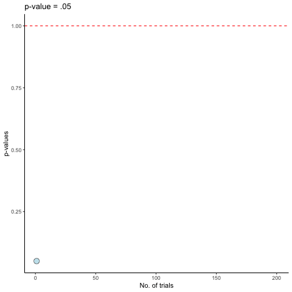
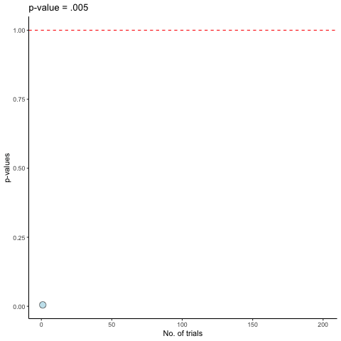

# Introduction:

In statistical analysis, it's important to have a solid understanding of the underlying data generating process before drawing any meaningful conclusions. 


To illustrate this concept, the following code chunk simulates five datasets ('Daten1' - 'Daten5') with 10 random samples ($n = 10$). 

The code generates the datasets using the rnorm() function, and ensures that the data is normally distributed with a mean of 0 (which is the default value if not otherwise specified) and standard deviation of 1 (which is the default value if not otherwise specified). 

By simulating datasets in this way, we can get a better understanding of what we would expect to see if we were to conduct statistical tests on random samples. 


As the data is generated RANDOMALY from the same distribution (i.e., with the same mean and $\sigma$), we shouldn't expect to find any actual differences when conducting statistical tests. 

This also means that we should operate under the assumption that the $H_{0}$ is true. 

Right?

If we do.... we should conclude that we are dealing with a false positive (Type I Error).

Whats the probability of obsering Type I error?

Let's take a closer look at the code and the plots.


```{r p-hacking simulation, echo=TRUE}

# UB 3: Aufgabe 1

# Stichprobengröße pro Experiment und pro Gruppe
n <- 10
# Der Seed stellt sicher, dass Sie die gleichen simulierten Daten erhalten 
# wie in der Musterlösung
set.seed(21)

# Simuliere Datensätze der 5 Experimente
# x1: Konzentrationsleistung der Gruppe mit Präsentation emotional belastender Stimuli
# x2: Konzentrationsleistung der Kontrollgruppe
Daten1 <- data.frame(x1 = rnorm(n), x2 = rnorm(n))
Daten2 <- data.frame(x1 = rnorm(n), x2 = rnorm(n))
Daten3 <- data.frame(x1 = rnorm(n), x2 = rnorm(n))
Daten4 <- data.frame(x1 = rnorm(n), x2 = rnorm(n))
Daten5 <- data.frame(x1 = rnorm(n), x2 = rnorm(n))
```


Lets look at some statistics.

We start with comoputeing the Cohen's $d$ for the comparison between the first data set and the 4 others.

```{r}
# Berechnung von Cohens d mit dem effsize Paket
library(effsize)
d1 <- cohen.d(Daten1$x1, Daten1$x2, na.rm = TRUE)$estimate
d2 <- cohen.d(Daten2$x1, Daten2$x2, na.rm = TRUE)$estimate
d3 <- cohen.d(Daten3$x1, Daten3$x2, na.rm = TRUE)$estimate
d4 <- cohen.d(Daten4$x1, Daten4$x2, na.rm = TRUE)$estimate
d5 <- cohen.d(Daten5$x1, Daten5$x2, na.rm = TRUE)$estimate
ds <- c(d1, d2, d3, d4, d5)
```


We proceed by computing the weights for each of the effect sizes obtained above. 

The formula is $w_{i} = \frac{1}{\frac{2*n}{n^2} + \frac{d^2}{4*n}}$.

Here are the weights for each effect size:

```{r}
# Berechnung der Gewichte
w1 <- 1 / (((2*n)/(n^2)) + ((d1^2) / (4*n)))
w2 <- 1 / (((2*n)/(n^2)) + ((d2^2) / (4*n)))
w3 <- 1 / (((2*n)/(n^2)) + ((d3^2) / (4*n)))
w4 <- 1 / (((2*n)/(n^2)) + ((d4^2) / (4*n)))
w5 <- 1 / (((2*n)/(n^2)) + ((d5^2) / (4*n)))
ws <- c(w1, w2, w3, w4, w5)
ws
```


And the CI for the sum of weighted effect sizes
```{r CI, echo=FALSE, warning=FALSE}
d <- sum(ds * ws) / sum(ws)
d - 1.96/sqrt(sum(ws))
d + 1.96/sqrt(sum(ws))
```


And finally, lets look if we encounter a somewhat surprising Type I error in t-tests
```{r t_tests, echo=FALSE, warning=FALSE}
# Überprüfung der zweiseitigen t-Tests
# Experiment 2 zeigt einen p-Wert relativ nahe an 0.05
t.test(Daten1$x1, Daten1$x2, var.equal = TRUE)
t.test(Daten2$x1, Daten2$x2, var.equal = TRUE)
t.test(Daten3$x1, Daten3$x2, var.equal = TRUE)
t.test(Daten4$x1, Daten4$x2, var.equal = TRUE)
t.test(Daten5$x1, Daten5$x2, var.equal = TRUE)
# KI für delta in Experiment 2 ist sehr breit
# auch Werte für den wahren Effekt nahe 0 sind plausibel
cohen.d(Daten2$x1, Daten2$x2, na.rm = TRUE)
```

```{r include=FALSE}
# FEHLER: OPTIONAL STOPPING!!!
# Simuliere eine neue Personen gro Gruppe in Experiment 2
Daten2 <- rbind(Daten2, rnorm(2))
# Überprüfe den p-Wert des t-Tests
t.test(Daten2$x1, Daten2$x2, var.equal = TRUE)
Daten2 <- rbind(Daten2, rnorm(2))
t.test(Daten2$x1, Daten2$x2, var.equal = TRUE)
Daten2 <- rbind(Daten2, rnorm(2))
t.test(Daten2$x1, Daten2$x2, var.equal = TRUE)
Daten2 <- rbind(Daten2, rnorm(2))
t.test(Daten2$x1, Daten2$x2, var.equal = TRUE)
Daten2 <- rbind(Daten2, rnorm(2))
t.test(Daten2$x1, Daten2$x2, var.equal = TRUE)
Daten2 <- rbind(Daten2, rnorm(2))
t.test(Daten2$x1, Daten2$x2, var.equal = TRUE)
Daten2 <- rbind(Daten2, rnorm(2))
t.test(Daten2$x1, Daten2$x2, var.equal = TRUE)

```

```{r}
# FEHLER: RESEARCHER DEGREES OF FREEDOM!!!
# Boxplot aus Experiment 2 zeigt einen "Ausreißer" in Gruppe 2
boxplot(Daten2$x1, Daten2$x2)
# Ersetze Ausreißer durch NA
Daten2[11, "x2"] <- NA
# Berechne erneut den p-Wert
t.test(Daten2$x1, Daten2$x2, var.equal = TRUE)

# Berechne d und w für Experiment 2 neu
d2 <- cohen.d(Daten2$x1, Daten2$x2, na.rm = TRUE)$estimate
w2 <- 1 / (((16+17)/(16*17)) + ((d2^2) / (2*(16+17))))

# FEHLER: PUBLICATION BIAS!!!
# Berechne metaanalytischen Hypothesentest mit ungerichteter H1
# nur für Experimente 2, 3, 4, 5
ds <- c(d2, d3, d4, d5)
ws <- c(w2, w3, w4, w5)
d <- sum(ds * ws) / sum(ws)
t_statistik <- d * sqrt(sum(ws))
2 * pnorm(t_statistik)

# FEHLER: HARKING!!!
# Berechne Hypothesentest mit linksgerichteter H1
pnorm(t_statistik)

library(pwr)
# FEHLER: POST HOC POWER!!!
# Berechne Stichprobenumfang mit dem Schätzwert d2 als wahres delta
pwr.t.test(power = 0.8, sig.level = 0.05, d = -1.034, alternative = "less")

# Konfidenzintervall für delta basierend auf Experiment 2 (nach p-Hacking)
cohen.d(Daten2$x1, Daten2$x2, na.rm = TRUE)
```

##*A littile background story:*
Once upon a time, there was a researcher named Bob who was tasked with analyzing data for his company. Bob had a lot of pressure on his shoulders, as his boss had promised to deliver some groundbreaking results by the end of the week. Bob knew he had to produce statistical results, but he was also aware that statistical analysis could be quite tricky.

Determined to get the job done, Bob started analyzing his data. After every single observation, Bob would check to see if the results were significant. If they weren't, he would move on to the next observation. 

However, as Bob was also a lazy p-hacker, he wanted to know how much time he will have to invest in this whole mess. He therefore created a function that simulates this process and will determines after how many observations (approximately) a significant p-value will be found. 

Bad, lazy Bob....😳


**Note:** this simulation was created by the hard-working, never-p-hacking 😉 Elisabeth Kraus.

Here is the code for the simulation
```{r sim_dat, echo=FALSE, include=FALSE}
# Lege Stichprobenumfang fest
n <- 10000

# Legee Freiheitsgrade der t-Verteilung fest
df <- 98


# ziehe t-Werte aus t-Verteilung
ts <- rt(n, df)


# betrachte Verteilung der gezogenen Werte
dens_t <- density(ts)
plot(dens_t)


# Finde p-Werte zu t-Werten
p_values <- pt(ts, df)


# plotte p-Werte
hist(p_values)


## Plotte beides zusammen ##
plot(ts, p_values)


# wenn H0 gilt: wie oft muss man optional stoppen (nachschauen), bis man mit 90% Wahrscheinlichkeit ein signifikantes Ergebnis findet?
p_find_sig <- 0.05

# Funktion, die ausrechnet, wie wahrscheinlich ein signifikantes Ergebnis ist nach einer bestimmten Anzahl an Versuchen (n) und einem alpha-Level von p_find_sig
wie_wschl_sig_nach_versuchen <- function(n, p_find_sig) {
  1 - ((1 - p_find_sig) ^ n)
}

```

Here is the simulation for p-hacking with $p \le .05$. 

```{r p_05, fig.align="center", out.height="90%", out.width = "90%", echo=FALSE}

```


Here is the simulation for p-hacking with $p \le .005$. 

```{r p_005, fig.align="center", out.height="90%", out.width = "90%", echo=FALSE}

```
